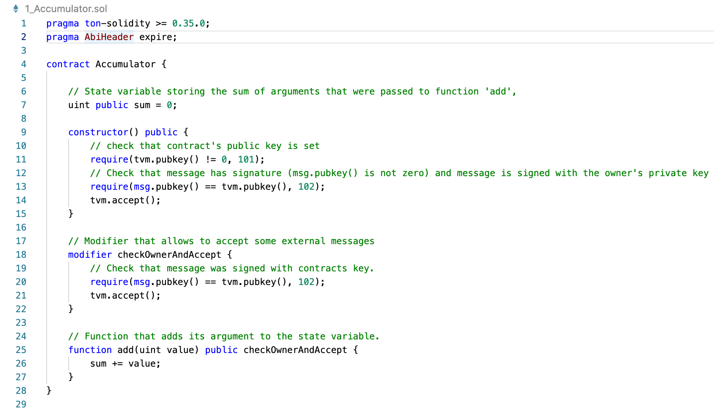
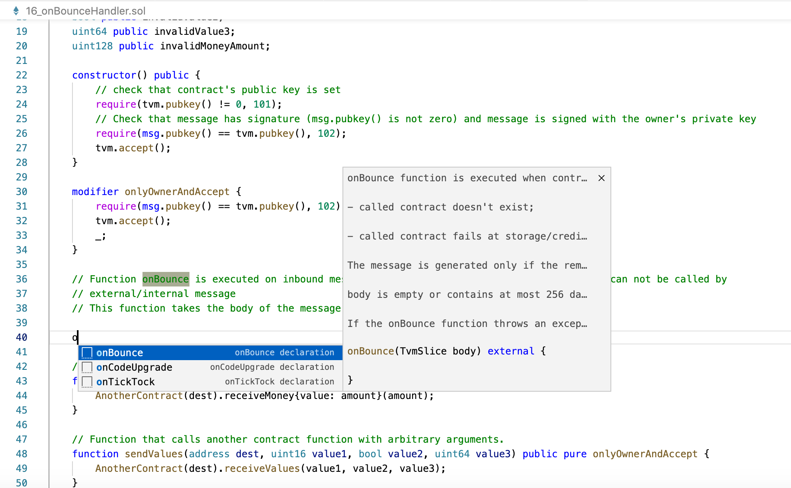
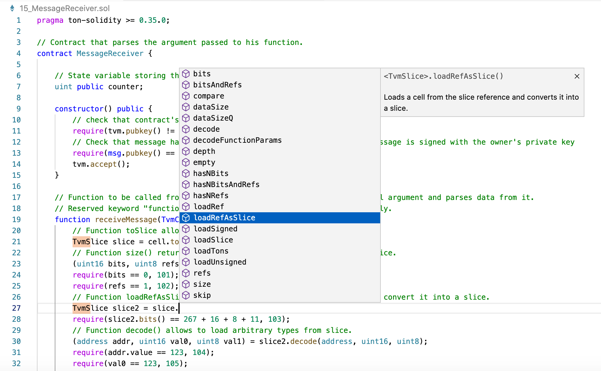

# Free TON Solidity Language for Visual Studio Code
Solidity Language support to [Visual Studio Code](https://code.visualstudio.com/), via the [vssolidity](https://github.com/Pruvendo/vssolidity.git).

The source code is available at [https://github.com/Pruvendo/vssolidity.git](https://github.com/Pruvendo/vssolidity.git).

Developed by [Pruvendo](https://pruvendo.com)

## Features
* Syntax highlighting
* Snippets
* Code completion for all contracts / libraries in the current file and all referenced imports

## Requirements
* *VsCode 1.30.0* or more recent

## Installation

Before the installation remove all the Solidity syntax highlighing plugins installed in you *VSCode*.

The recommended way to install VSSolidity is via
the [Visual Studio Marketplace](https://marketplace.visualstudio.com/items?itemName=Pruvendo.vssolidity).

In case of manual build use the following sequence of actions:
* Install latest *npm*
* Install *vsce* (*sudo npm -g vsce*)
* Prepare the package (*vsce pack*) (run from the root directory of the project)
* In *VSCode* select *Preferences/Extensions*
* Select *Install from VSIX*
* Select the *.vsix* file generated by *vsce*

## Detailed documentation

### Motivation

At the present time there is a number of sophisticated *VSCode* syntax highlishters for Solidity, such as *juanblanco.solidity*, however, all of them are designed for Ethereum that is different than Free TON version of this language.

An option to adopt one of the existing open-source plugins was considered however their complexity convinced us to develop a Free TON Solidity syntax highlighter **from scratch**.


### Syntax highlight

The following elements are automatically highlighted:
- Comments
  - Block comments (`/* */`)
  - Line comments (`//`)
  - The following tags are also specially highlighted inside the comments:
    - Commented lines that start with *TODO*, *FIXME*, *CHANGED*, *XXX*, *IDEA*, *HACK*, *NOTE*, *REVIEW*, *NB*, *BUG*, *QUESTION*, *COMBAK*, *TEMP*, *SUPRESS*, *LINT*.
    - Commented lines with metatags such as *@title*, *@author*, *@notice*, *@dev*, *@param*, *@return*
- Operators
  - Logical (`<`, `==`, `>`, `<=`, `>=`, `!=`, `&&`, `||`)
  - Arithmetic (`+`, `-`, `/`, `*`)
  - Binary (`^`, `&`, `|`)
  - Mapping (`=>`)
  - Assignment (`=`)
- Control flow
  - Conditions (`if`, `else`)
  - Loops (`for`, `while`, `do`, `continue`, `break`)
  - Exceptions (`try`, `catch`, `finally`)
  - `return` operators
- Constants
  - Logical (`true`, `false`)
  - Temporal (`seconds`, `minutes`, `hours`, `days`, `weeks`, `years`)
  - Financial (`ton`)
  - Numbers (decimal and hexadecimals)
  - Strings
- Types
  - Primitive types - `bool`, `uint_<size>`, `int_<size>`, `address`, `string`, `bytes`, `hash_<size>`
  - Complex types (`struct`, `enum`, `mapping`, arrays)
- Built-in constructions
  - variables (`this`, `super`, `abi`, `msg.sender`, `msg`, `block`, `tx`, `now`, `tx.origin`, `tx.gasprice`, `msg.data`, `msg.sig`, `msg.value`)
  - functions (`require`, `assert`, `revert`, `selfdestruct`, `suicide`, `addmod`, `mulmod`, `keccak256`, `sha256`, `sha3`, `ripemd1t60`, `ecrecover`, `unicode`, `blockhash`, `gasleft`, `type`)
- Modifiers
    - Access modifiers (`internal`, `external`, `private`, `public`, `inline`)
    - Payable modifiers (`payable`, `nonpayable`)
    - `immutable`
    - Extended modifiers (`pure`, `view`, `inherited`, `indexed`, `storage`, `memory`, `virtual`, `calldata`, `override`, `abstract`, `responsible`)
    - Custom modifiers
- User identifiers
- Punctuation characters (`{`, `}`, `;`, `.`, `,`, `[`, `]`, `(`, `)`)
- Specific constructions
  - imports
  - pragmas
  - contracts and interfaces
  - constructors
  - `function` and `modifier`
  - `new` and `delete`
  - events
  - `emit`
  - `using ... for`
  - `unchecked`
  - `assembly` and `let`

The example of the highlighted source code is provided below:




### Code snippets

The snippets allow to automatically insert some fragments of code. For example, if the user starts to enter *enum* keyword the suggestion to use the snippet automatically appears. In case of agreement the following code is generated:

````
enum Name {item1, item2 }
````

Currently the following snippets are supported (the word in parentheses indicates what should be typed (fully or partially) to switch the snippet suggestion on):

- contract declaration (`contract`)
- constructor declaration (`constructor`)
- enum declaration (`enum`)
- error declaration (`error`)
- event declaration (`event`)
- `for` statement (`for`)
- function declaration (`function`)
- function return declaration (`function-return`)
- function view declaration (`function-view`)
- function view return declaration (`function-view-return`)
- function pure declaration (`function-pure`)
- function pure return declaration (`function-pure-return`)
- function inline return declaration (`function-inline-return`)
- function functionID declaration (`function-functionID`)
- function externalMsg declaration (`function-externalMsg`)
- function internalMsg declaration (`function-internalMsg`)
- `if` statement (`if`)
- `if ... else` statement (`ife`)
- `import` (`import`)
- interface declaration (`interface`)
- interface returns declararion (`interface-returns`)
- library declaration (`library`)
- `mapping` declaration (`mapping`)
- `modifier` declaration (`modifier`)
- `pragma ton-solidity` (`pragma`)
- `pragma ton-solidity` example (`pragma-ex`)
- `pragma ignoreIntOverflow` (`pragma-ig`)
- `pragma AbiHeader` (`pragma-ab`)
- `pragma msgValue` (`pragma-ms`)
- `require` (`require`)
- `unchecked` (`unchecked`)
- `receive` declaration (`receive`)
- `fallback` declaration (`fallback`)
- `onBounce` declaration (`onBounce`)
- `onTickTock` declaration (`onTickTock`)
- `onCodeUpgrade` declaration (`onCodeUpgrade`)
- `afterSignatureCheck` declaration (`afterSignatureCheck`)
- `selfdestruct` declaration (`selfdestruct`)
- `sha256` declaration (`sha256`)
- `gasToValue` declaration (`gasToValue`)
- `valueToGas` declaration (`valueToGas`)
- help runtime error codes (`help-runtime-error-codes`)



### Code completion

The following TON-types are supported:

- TvmCell
- TvmSlice
- TvmBuilder
- uint[]
- bytes
- string



The following TON-functions are supported:

- msg
- tvm
- math
- tx
- block
- rnd


### Further plans

For the next version it's planned to implement a real deep grammar analysis of the code that will let:
- Discover the syntax errors
- Implement the movement to the function implementations
- Discover unused identifiers
- ... and much more

## Feedback

The developers welcome any feedback and suggestions about improvement of the current functionality and setup. Feel free to contact the project lead [Sergey Egorov](https://t.me/SergeyEgorovSPb) or the key developer [Ruben Akhayan](https://t.me/RubenA).
